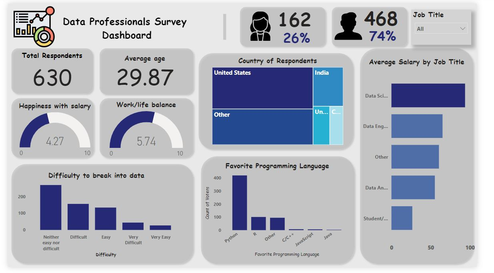

# Data-Professionals-Survey-Analysis

## Introduction

This project shows the various attributes of careers in the data space ranging from Data Analyst, Data Engineers, Data Architect, and many more. 
There have been lots of bants in the data community about which of the data roles is overriding and I find it interesting everytime I pump on those conversations.
The goal is to use this dataset to answer some questions.
I hope you enjoy going through this project as much as I did working on it. 😊✨

*N.B: this project does not give an exhaustive or definite analysis. Region, and company can be a factor to vary from the findings we have here.*

## Data Sourcing

The dataset was gotten from Alex the Analysts YouTube video and is linked [here](https://github.com/AlexTheAnalyst/Power-BI).
Alex explained that he got the *real-life* data from professionals in the data space using a survey.

## Problem Statement
The following questions were answered based on how the data was transformed:

1. The job title with the highest salary - (My favourite part😁)
2. Gender with the highest respondent - (yeah, you guessed right😎)
3. Country of resident of respondents
4. Favourite programming language
5. Difficulty to break into the space
6. Level of happiness with Salary and Work/life balance.

## Data Transformation

The dataset came really messy and required a good time of data transformation.
All the cleaning was done on Power BI but was importing as a CSV file. 
The following issues:
- Missing values
- Data redundabcy
- Inconsistencies
- Empty columns
- Inaccurate entries

## Skills/Concept documented

To get some columns for visualization and storytelling, I created new measures.
used DAX, and filters.

## Data Modelling
No modelling was done in this project as there was just one table.

## Analysis and Visualization

From the dashboard, we see that
- There were 630 total respondents that filled the survey with a whooping 74% male and 24% female respondents - *This is a call for more women into the data profession.😀*
- 

